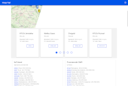
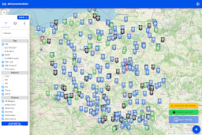
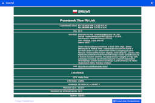

# Informacje

**Polacy nie gęsi i swój portal z przemiennikami radiowymi mają**

Kod źródłowy pierwszej wersji strony [mapy73.pl](https://mapy73.pl/) - (niebieski layout), ponad 99 comitów kodu pisanego po nocy przez 11 miesięcy. Repozytorium nazwane `gorący-kartofel` w czasach gdy strona przemienniki.net przestała działać i nikt nie chiał podjąć się tematu `styczeń 2025` (kod strony napisany od zera wokół udostępnionego dla wszystkich dupma bazy danych by baza naszych przemienników radiowych nie przepadła).

<table>
  <tr>
    <td align="center">
      
    </td>
    <td align="center">
      
    </td>
    <td align="center">
      
    </td>
  </tr>
</table>

## Spełnione założenia

 * strona może być hostowana na bezpłatnym hostingu (serverlesss), lub po kosztach jako zwykła strona html z odpłatnym transeferem servera jeśli kogoś stać.
 * odporna na wstrzykiwanie źlośliwego kodu, brak serwera bazdanowego, brak backendu i brak luk bezpieczeństwa z nimi związanymi.
 * możliwośc działania w trybie offline, w sytułacjach awaryjnych w przypadku braku infrasktury/braku intenetu (uruchomiona lokalnei na komputerze [localhost:8100](http://localhost:8100/) lub tryb Offline instalowany automatycznie jesli strona jest hostowana w intenecie )
 * możliwośc opublikowania strony jako osobna aplikacja na [Androida](https://play.google.com/) lub [iOS](https://apps.apple.com/) ([dzięki Ionic](https://ionicframework.com/docs/angular/your-first-app/distribute))
 * [osobna publiczna baza przemienników](https://github.com/Krusz-Beton/przemienniki-mapy73pl) dostępna dla całej społeczności niezależna od kodu strony. Pełna historia zmian, oraz natychmiastowy backup danych w przypadku zdażen losowych / dłuszej nieobecności tego który to pisze.
 * możliwośc [fitracji przemienników](https://www.youtube.com/watch?v=pn6jd8xVn0g) po wielu parametrach i dodania do exportu
 * export przemienników do Excela lub formatów dostosowanych dla: Chipr, Icom, Yaesu, [OpenGD77](https://youtu.be/iOTE3sBbiu4?si=HOK5fIKNQaGhfHaX&t=50)

# Podziękowania
 * dla **Łukasza SQ5LWN**, który włożył ogrom darmowej pracy przez lata w rozwój pierwowzoru serwisu przemienników (w mojej opini niedoceniony i zbyt pochopnie krytykowany przez niektórych)
 * dla wszysktich poprzednich zgłaszających zmiany i moderatorów serwisu przemienniki.net dzięki którym powstała dość spora baza danych i na początku 2025 można było analizować ogrom przypadków i mieć dość solidny punkt startowy.
 * dla wszystkich którzy ciągle dbają o poprawność danych na bierząco zgłaszając błedy [na stronach przemienników](https://mapy73.pl/repeaters-list/pl/) dbając by cała społeczność radiowa miała aktulane dane.

# 1. Jak uruchomić kod źródłowy

## 1.1 Na lokalnej maszynie

# 2. Jak opublikować

## 2.1 Na hostingu

## 2.2. W sklepie Play Google dla Andorida

## 2.2. W sklepie Apple dla iOS

