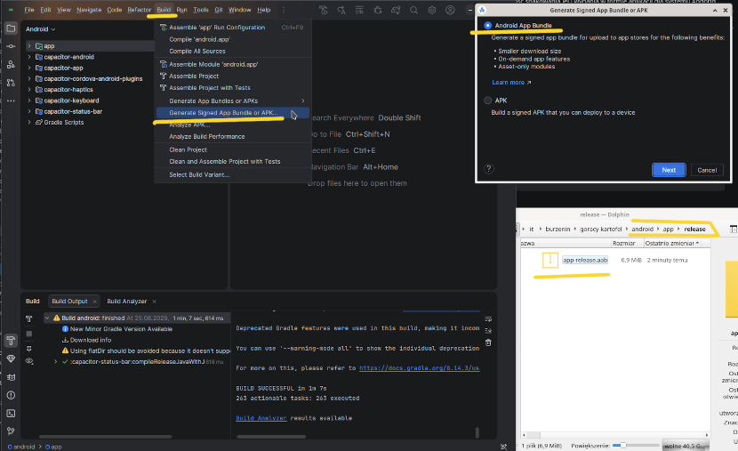

# Informacje

**Polacy nie gęsi i swój portal z przemiennikami radiowymi mają**

Kod źródłowy pierwszej wersji strony [mapy73.pl](https://mapy73.pl/) - (niebieski layout), ponad 99 comitów kodu pisanego po nocy przez 11 miesięcy. Repozytorium nazwane `gorący-kartofel` w czasach gdy strona przemienniki.net przestała działać i nikt nie chiał podjąć się tematu `styczeń 2025` (kod strony napisany od zera wokół udostępnionego dla wszystkich dupma bazy danych by baza naszych przemienników radiowych nie przepadła).

<table>
  <tr>
    <td align="center">
      <a href="docs/images/001.png">
        
      </a>
    </td>
    <td align="center">
      <a href="docs/images/002.png">
        
      </a>
    </td>
    <td align="center">
      <a href="docs/images/003.png">
        
      </a>
    </td>
  </tr>
</table>

## Spełnione założenia

 * strona może być hostowana na bezpłatnym hostingu (serverlesss), lub po kosztach jako zwykła strona html z odpłatnym transeferem servera jeśli kogoś stać.
 * odporna na wstrzykiwanie źlośliwego kodu, brak serwera bazdanowego, brak backendu i brak luk bezpieczeństwa z nimi związanymi.
 * możliwośc działania w trybie offline, w sytułacjach awaryjnych w przypadku braku infrasktury/braku intenetu (uruchomiona lokalnei na komputerze [localhost:8100](http://localhost:8100/) lub tryb Offline instalowany automatycznie jesli strona jest hostowana w intenecie )
 * możliwośc opublikowania strony jako osobna aplikacja na [Androida](https://play.google.com/) lub [iOS](https://apps.apple.com/) ([dzięki Ionic](https://ionicframework.com/docs/angular/your-first-app/distribute))
 * [osobna publiczna baza przemienników](https://github.com/Krusz-Beton/przemienniki-mapy73pl) dostępna dla całej społeczności niezależna od kodu strony. Pełna historia zmian, oraz natychmiastowy backup danych w przypadku zdażen losowych / dłuszej nieobecności tego który to pisze.
 * możliwośc [fitracji przemienników](https://www.youtube.com/watch?v=pn6jd8xVn0g) po wielu parametrach i dodania do exportu
 * export przemienników do Excela lub formatów dostosowanych dla: Chipr, Icom, Yaesu, [OpenGD77](https://youtu.be/iOTE3sBbiu4?si=HOK5fIKNQaGhfHaX&t=50)

# Podziękowania
 * dla **Łukasza SQ5LWN**, który włożył ogrom darmowej pracy przez lata w rozwój pierwowzoru serwisu przemienników (w mojej opini niedoceniony i zbyt pochopnie krytykowany przez niektórych)
 * dla wszysktich poprzednich zgłaszających zmiany i moderatorów serwisu przemienniki.net dzięki którym powstała dość spora baza danych i na początku 2025 można było analizować ogrom przypadków i mieć dość solidny punkt startowy.
 * dla wszystkich którzy ciągle dbają o poprawność danych na bierząco zgłaszając błedy [na stronach przemienników](https://mapy73.pl/repeaters-list/pl/) dbając by cała społeczność radiowa miała aktulane dane.

# 0. Przygotowania środowiska

## 0.1 Instalacja

1. Zainstaluj [Node.js](https://nodejs.org/en/download)

2. Zainstaluj [Git](https://git-scm.com/install/linux)

3. Skonuj te repozytorium
```bash
git clone https://github.com/Hotel-Foxtrot-Tango-Echo/goracy-kartofel.git
```
4. Wejdz do katalogu i zainstaluj zależności projketu
```bash
cd goracy-kartofel
```
```bash
npm i
```

5. Zainstaluj globalnie [Ionic CLI](https://ionicframework.com/docs/cli)
```bash
npm install -g @ionic/cli
```
# 1. Jak uruchomić kod źródłowy

## 1.1 Na lokalnej maszynie

Wejdz do katalogu i uruchom serwer
```bash
cd goracy-kartofel
```
```bash
ionic s
```
Strona pojawi się na lokalnej maszynie pod adresem: http://localhost:8100

# 2. Jak opublikować

## 2.1 Na hostingu

## 2.2. W sklepie Play Google dla Andorida

Użyte biloteki mają możliwośc wydania strony w formie aplikacji dla systemu Andorid, jakby ktoś potrzebował taką fizyczną aplikację którą można kliknąć na telefonie bo ta wersja na hostingu kilkana w przeglądarce (z trybem offline) to dla niego za mało.

1. Zainstaluj [Android Sudio](https://developer.android.com/studio)

2. W zmienych systemowych wskaz link do Andorid studio dla Capacitora
```bash
export CAPACITOR_ANDROID_STUDIO_PATH="/usr/local/android-studio/bin/studio.sh"
```

3. Do capacitor dodaj srodowisko dla Andorida
```bash
ionic cap add android
```

4. Zbuduj stronę
```bash
ionic build --prod
```

5. Zchyronizuj moduły Capacitora
```bash
npx cap sync android

```

6. Zaktualizuj zbudowaną stronę w środowisku Angulara
```bash
npx cap copy android
```

7. Uruchom projekt w Andorid Sudio
```bash
npx cap open android
```

8. Zbuduj apliakcje

W Android Sudio wybierz kolejno `Build` > `Generate Signed App Bundle or APK..`
* w oknie dialogowym wybierz `Andorid App Bundle`



Efekt kompilacji pojawi sie w katalogu `android/app/relase` finalny plik `.aab` nadaje się bezpośredio do publikacji w Sklepie Google

Jeśli nie chesz publikować aplikacji w Sklepie Google a od razu wgac do swojego Andoida. 
* w oknie dialogowym wybierz `APK`

pojawi się plik `.apk` który można wgrać bezpośrednio do telefonu pomijając Sklep Google.

## 2.2. W sklepie Apple dla iOS


Podobne kroki jak publikowanie [dla Andorida](#22-w-sklepie-play-google-dla-andorida) zmieniajac komendy z koncowką andorid na ios:

np dajmy na to komęde 
```bash
ionic cap add android
```
zamien na
```bash
ionic cap add ios
```

Ale że średno mnie stać na jakieś urządzeniez z makiem i nic z tych sprzętów nie mam więc nie będe udawał że się na tym znam, więc znalazłem dla was oficialne linki z instrukcjami 
* [doc1 Ionic iOS Deploy](https://ionicframework.com/docs/deployment/app-store) 
* [doc2 Ionic iOS Build](https://ionicframework.com/docs/angular/your-first-app/deploying-mobile)

Powodzenia!


# 9. Dodatek


## 9.1 Aktualizacja przemienników

Aktualna baza przemienników rozwijana jest w [osobnym repozytorium](https://github.com/Krusz-Beton/przemienniki-mapy73pl)  na podstawie wysyłanych zgłoszeń radioamatorów przez strone mapy73.pl (opcja `zgłość błąd` na stronie każdego przmeinnika)

1. Zaktualizuj repozytorium gita z bazą przemienników (już repozytorium skonfigurowane w tym projekcie jako sumoduł w pliku `.gitmodules`)
```bash
git submodule update --remote 
```
po wykonaniu tej komedy w katalogu `submodules/repeters` pojawi sie najnowsza baza przemienników

2. Zaktualizuj przemienniki na stronie (uruchom przygotowany skrypt)
```bash
. skrypt-update-rpts
```
po wykoaniu tej komedy katalog `public/api/v2` zostanie zaktualizowany statycznymi plikami (wymuszony cache często odwiedzanych plików, dzięki temu backend nie jest potrzebny na serwerze a i wyświetlanie pojedyczych przemienników trwa szybciej)
